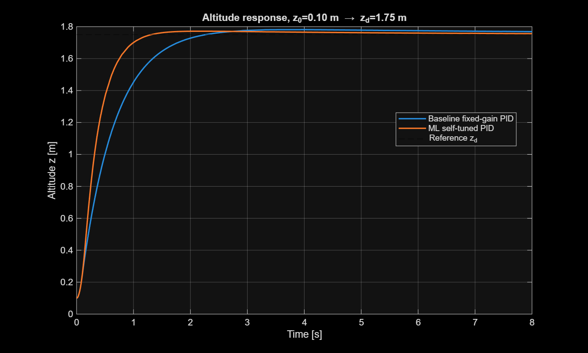
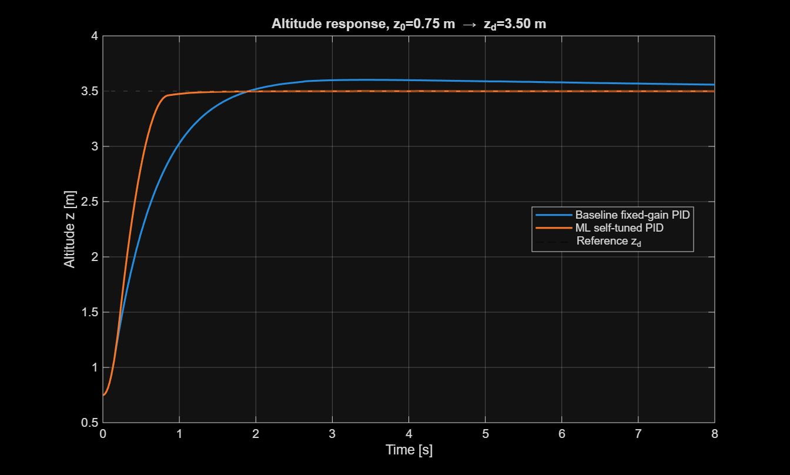
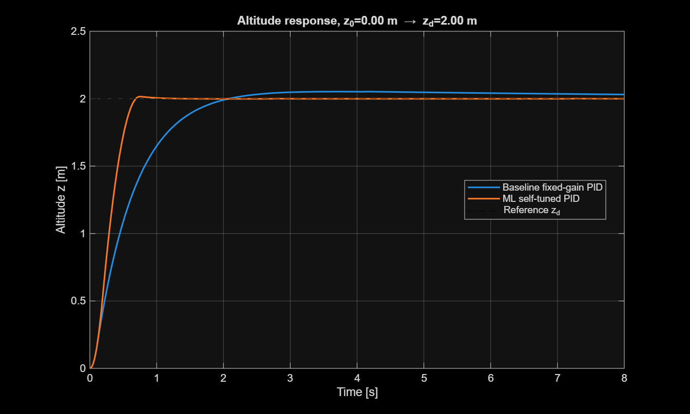
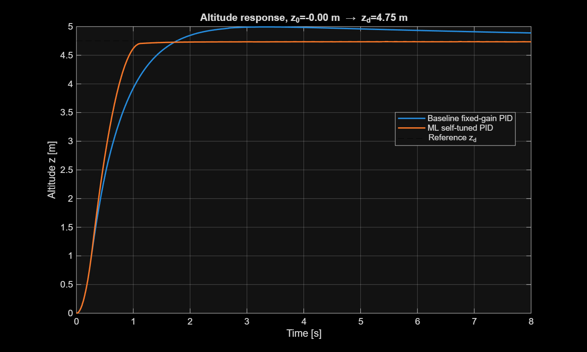

# Task 4 — ML-Based Self-Tuning PID Results

## Objective

Task 4 evaluates the trained machine-learning PID tuner against the fixed baseline PID controller for quadcopter altitude control.

The ML model predicts the PID gains from the operating condition **(z₀, z_d)**, where `z0` is the initial altitude and `zd` is the desired altitude.

The predicted gains are applied **once before each simulation run**. Therefore, the implemented method is a **mission-start ML-based self-tuning / gain-scheduling approach**, rather than continuous online adaptation during flight.

---

## Baseline PID Controller

The fixed baseline gains are:

| Gain | Value |
|---|---:|
| Kp | 56.8136 |
| Ki | 7.3365 |
| Kd | 31.7435 |

These gains are used as the reference controller for all Task 4 comparisons.

---

## Test Cases

Four operating conditions were evaluated:

| Case | z0 (m) | zd (m) | Test Type |
|---|---:|---:|---|
| 1 | 0.10 | 1.75 | Interpolated / off-grid |
| 2 | 0.75 | 3.50 | Interpolated / off-grid |
| 3 | 0.00 | 2.00 | Validated baseline sanity case |
| 4 | 0.00 | 4.75 | Extrapolation beyond training range |

Case 3 corresponds to the validated `z0 = 0 m`, `zd = 2 m` operating point.

Case 4 intentionally tests extrapolation because `zd = 4.75 m` lies outside the Task 3 training range.

---

## Predicted ML PID Gains

| Case | Kp | Ki | Kd |
|---|---:|---:|---:|
| 1 | 49.9094 | 10.6029 | 15.2425 |
| 2 | 74.2555 | 4.8864 | 24.4519 |
| 3 | 52.0096 | 8.1864 | 14.1014 |
| 4 | 92.8794 | 1.5722 | 39.8650 |

The ML tuner selects different PID gains according to the initial and desired altitude instead of using one fixed gain set for every operating condition.

---

## Baseline vs ML Performance

### Case 1 — z0 = 0.10 m, zd = 1.75 m

| Metric | Baseline PID | ML-Tuned PID |
|---|---:|---:|
| Overshoot (%) | 1.7997 | 1.2307 |
| Rise Time (s) | 1.1834 | 0.6649 |
| Settling Time (s) | 1.9361 | 1.1616 |
| ITAE | 1.1864 | 0.5181 |

The ML-tuned controller reduces overshoot, rise time, settling time, and ITAE.



---

### Case 2 — z0 = 0.75 m, zd = 3.50 m

| Metric | Baseline PID | ML-Tuned PID |
|---|---:|---:|
| Overshoot (%) | 2.9119 | 0.0151 |
| Rise Time (s) | 1.1163 | 0.5126 |
| Settling Time (s) | 6.8496 | 0.7842 |
| ITAE | 3.0901 | 0.2724 |

The ML-tuned controller produces almost zero overshoot and substantially reduces settling time and tracking error.



---

### Case 3 — z0 = 0.00 m, zd = 2.00 m

| Metric | Baseline PID | ML-Tuned PID |
|---|---:|---:|
| Overshoot (%) | 2.6254 | 0.7667 |
| Rise Time (s) | 1.1588 | 0.4138 |
| Settling Time (s) | 6.2101 | 0.6424 |
| ITAE | 1.7612 | 0.1425 |

This case checks that predictions remain sensible near the original validated design point. The ML tuner selects an alternative gain set that outperforms the fixed baseline on all four measured metrics. This is expected because the baseline gains provide a fixed controller, while the ML training labels were obtained through scenario-specific local optimization using the defined performance cost.



---

### Case 4 — z0 = 0.00 m, zd = 4.75 m

| Metric | Baseline PID | ML-Tuned PID |
|---|---:|---:|
| Overshoot (%) | 5.1361 | 0.0000 |
| Rise Time (s) | 1.0272 | 0.6578 |
| Settling Time (s) | 8.0000 | 1.0550 |
| ITAE | 6.9002 | 1.1711 |

This is an extrapolation test outside the training range. The ML-tuned controller achieves zero measured overshoot and substantially improves settling time and ITAE in this simulation.

Because this operating point lies outside the training range, the result should be interpreted as a test-case observation rather than a guarantee of general extrapolation performance.



---

## Overall Comparison

Across the four evaluated test cases, the ML-tuned PID controller improved all measured performance metrics compared with the fixed baseline PID:

- Lower overshoot in **4/4** cases
- Faster rise time in **4/4** cases
- Faster settling time in **4/4** cases
- Lower ITAE in **4/4** cases

The improvement at Case 3 is particularly notable because `(z0, zd) = (0, 2)` is the original validated operating point. The baseline controller uses one fixed gain set, whereas the ML-derived gains are based on scenario-specific optimization of the defined performance objective. Therefore, the ML tuner can select a different gain combination that provides better point-specific performance.
The results demonstrate that selecting PID gains according to the operating condition can outperform using a single fixed set of PID gains across the tested altitude-control scenarios.

---

## Self-Tuning Workflow

The implemented Task 4 workflow is:

1. Specify the initial altitude `z0` and desired altitude `zd`.
2. Load the trained ML models from `pid_tuner_net.mat`.
3. Predict `Kp`, `Ki`, and `Kd` from `[z0, zd]`.
4. Apply the predicted gains to the Simulink PID Controller block.
5. Run the nonlinear 6-DOF quadcopter simulation.
6. Measure overshoot, rise time, settling time, and ITAE.
7. Compare the ML-tuned response against the fixed baseline PID controller.

---

## Result Files

The numerical results are stored in:

`results/task4_comparison_results.csv`

The Task 4 implementation is located in:

`src/task4_selftuning_pid.m`

The trained PID tuner is stored in:

`data/pid_tuner_net.mat`

---
## Simulation Command-Line Output

The following output was obtained from the Task 4 MATLAB simulation:

```text
=== Test case 1: z0=0.10  zd=1.75 ===

  Baseline : Kp=56.81 Ki=7.34 Kd=31.74 | OS=1.8% Tr=1.18s Ts=1.94s ITAE=1.186
  ML-tuned : Kp=49.91 Ki=10.60 Kd=15.24 | OS=1.2% Tr=0.66s Ts=1.16s ITAE=0.518


=== Test case 2: z0=0.75  zd=3.50 ===

  Baseline : Kp=56.81 Ki=7.34 Kd=31.74 | OS=2.9% Tr=1.12s Ts=6.85s ITAE=3.090
  ML-tuned : Kp=74.26 Ki=4.89 Kd=24.45 | OS=0.0% Tr=0.51s Ts=0.78s ITAE=0.272


=== Test case 3: z0=0.00  zd=2.00 ===

  Baseline : Kp=56.81 Ki=7.34 Kd=31.74 | OS=2.6% Tr=1.16s Ts=6.21s ITAE=1.761
  ML-tuned : Kp=52.01 Ki=8.19 Kd=14.10 | OS=0.8% Tr=0.41s Ts=0.64s ITAE=0.142


=== Test case 4: z0=-0.00  zd=4.75 ===
  [note] (z0,zd) is outside the training range -- extrapolation, treat with caution.

  Baseline : Kp=56.81 Ki=7.34 Kd=31.74 | OS=5.1% Tr=1.03s Ts=8.00s ITAE=6.900
  ML-tuned : Kp=92.88 Ki=1.57 Kd=39.87 | OS=0.0% Tr=0.66s Ts=1.06s ITAE=1.171


=== Summary (ITAE improvement, negative = ML better) ===
  Case 1: ITAE change = -56.3%,  overshoot: 1.8% -> 1.2%
  Case 2: ITAE change = -91.2%,  overshoot: 2.9% -> 0.0%
  Case 3: ITAE change = -91.9%,  overshoot: 2.6% -> 0.8%
  Case 4: ITAE change = -83.0%,  overshoot: 5.1% -> 0.0%
```
---

## Conclusion

The Task 4 simulations show that the trained ML model can select operating-condition-dependent PID gains that outperform the fixed baseline controller for all four evaluated altitude-control cases.

The strongest improvements are observed in settling time and ITAE, while overshoot and rise time are also reduced in every test case.

The current implementation performs gain prediction once at the beginning of each mission/test case. It therefore demonstrates **ML-based self-tuning PID gain selection**, while continuous in-flight adaptation remains a possible extension for future work.